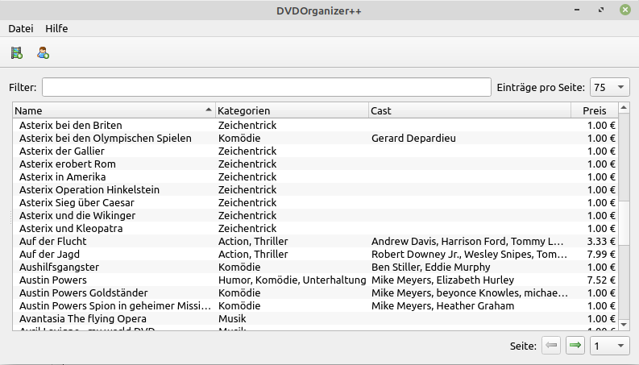

# DVDOrganizer++

This were my first steps with Qt and C++. I had orignally written my litte DVDOrganizer in Turbo Delphi but wanted to port it to sqlite3 and figured why not learn C++ and Qt to achieve that.

I never found the time to go further than just saving new movies to the database though :)... so currently this version remains unmaintained. I want to return at some point to extend my C++ skills, when the time allows.

I'm also currently porting the Codebase over to Python and PyQt5, since my Job requires Python Skills... so maybe look at that repo for a more up-to-date version.

---

## Screenshot of the Mainwindow

